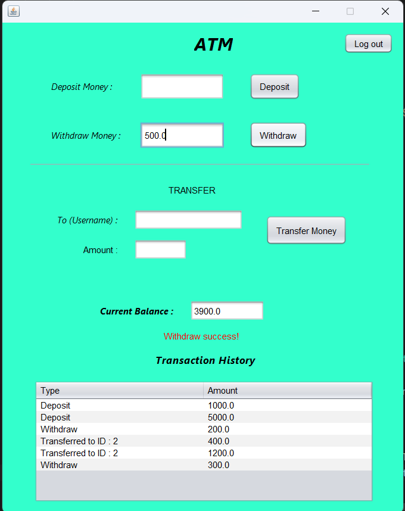
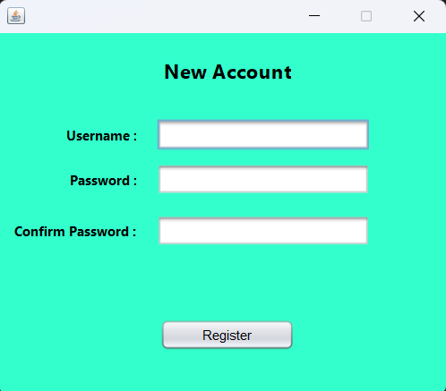

# Simple ATM GUI with Java and MySQL Integration

This project implements a functional ATM simulator using Java with a user-friendly graphical interface and MySQL database integration. Users can register and log in to securely access their accounts and perform basic banking operations like deposits, withdrawals, and money transfers between accounts. Transaction history is securely stored in the database, allowing users to review past activities. Developed with simplicity in mind, this project demonstrates core concepts of database interaction, user interface design, and object-oriented programming in Java.

## Screenshots

